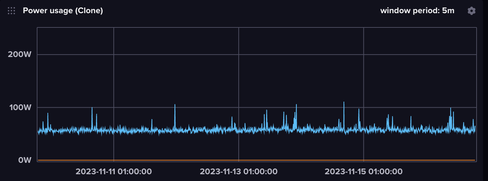

# Power consumption TP-Link HS110 to InfluxDB

Provide environment like :

```
NODE_INFLUX_TOKEN=XXXXXX
NODE_INFLUX_URL=http://XXXXXXXXX
NODE_INFLUX_ORG=XXXXXXX
NODE_INFLUX_BUCKET=XXXXXX
NODE_TPLINK_IP=192.168.1.5
NODE_ENABLE_LOG=1
NODE_INTERVAL_SECONDS=10
```

## Chronograf screenshot


